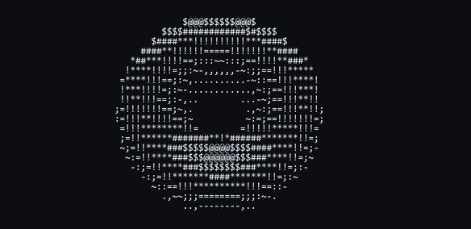

## Hi, I'm Ryan 👋 

I write code about shapes:

- Sometimes the shapes are [protein backbones](https://github.com/ryan-charette/psl-protein-flexibility).  
- Sometimes they are [cardiac surfaces](https://github.com/ryan-charette/cardiac-surface-fitting).  
- Sometimes they are [galaxies](https://github.com/ryan-charette/galaxy-collision-simulation).  

I'm mostly looking for excuses to sneak geometry and topology into scientific simulations.

     
  Figure 1: spinning ASCII coffee mug

Currently interested in: scientific computing/visualization, computational geometry/topology, high-performance computing, and machine learning (mostly reinforcement learning). I'm always open to collaboration! The best way to reach me is [email](mailto:ryanacharette@gmail.com).

## General problem solving principle(s)
1. Draw a picture first
