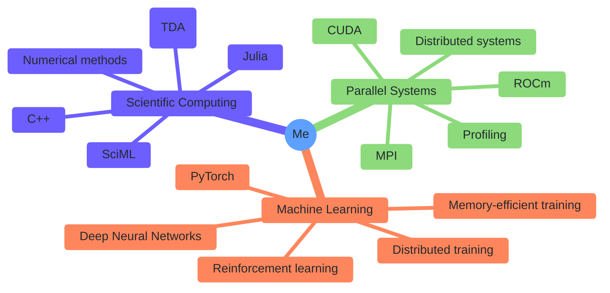

### Hi, I'm Ryan 👋 

---
I'm a mathematician and computer scientist. I like to work with theory-informed computer systems. [Clifford](https://www.instagram.com/p/CaqYiWRMyBR) is usually a big help.

- 🧮 Check out [Lean](https://github.com/leanprover/lean4) proof assistant! I’d love to see something like “citizen mathematics” become more of a thing
- 🧙‍♂️ Currently working on a 500+ room megadungeon for D&D B/X (this probably counts as systems engineering)
- 🎎 Fun fact! I spent a year in Japan, where I studied [traditional puppetry](https://en.wikipedia.org/wiki/Bunraku)

I'm best reached via [email](mailto:ryanacharette@gmail.com). Feel free to reach out if you want to collaborate or just talk about interesting ideas!

#

