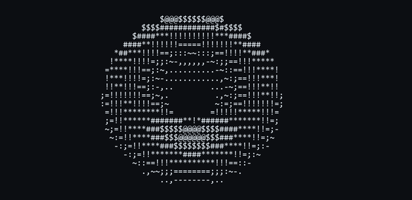

  

  
  
  
  

## About me

I'm Ryan. My interests center on **pure mathematics, especially topology and geometry**. I enjoy moving between abstract ideas, explicit examples, and computation—exploring mathematical structures and making the reasoning behind them precise.

My background in scientific computing informs how I work: mathematical software, numerical experiments, visualization, and formal proof. I'm always happy to talk math or collaborate on an interesting problem.

**[Explore my repositories →](https://github.com/ryan-charette?tab=repositories)**

## Tools I work with

  
  
  
  
  
  
  

## GitHub at a glance

  

  
  

  

More activity stats

  
  

A topologist's coffee mug

  

  Community widgets: <a href="https://github.com/kyechan99/capsule-render">Capsule Render</a> · <a href="https://shields.io">Shields.io</a> · <a href="https://github.com/vn7n24fzkq/github-profile-summary-cards">Profile Summary Cards</a> · <a href="https://github.com/DenverCoder1/github-readme-streak-stats">Streak Stats</a>

