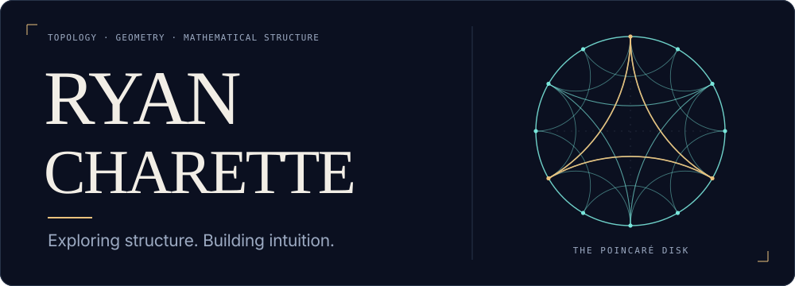
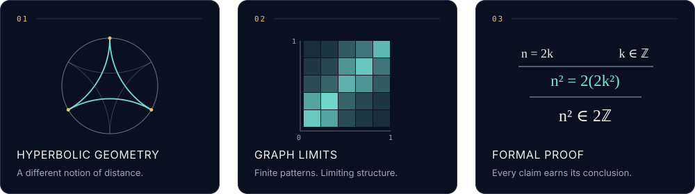
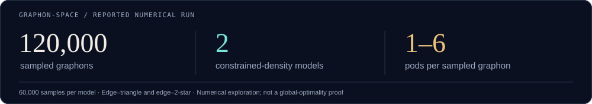
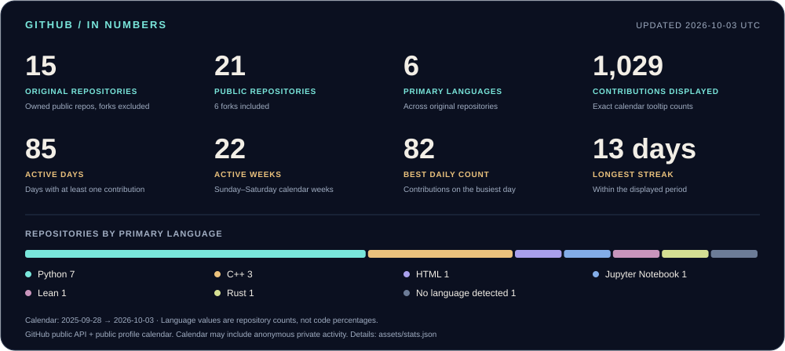

  

  <a href="mailto:ryancharette@utexas.edu">Email</a> ·
  <a href="https://orcid.org/0009-0006-3681-8535">ORCID</a> ·
  <a href="https://www.researchgate.net/profile/Ryan-Charette-3/research">Research</a> ·
  <a href="https://www.linkedin.com/in/ryan-charette">LinkedIn</a>

## Mathematics, made explicit.

I'm Ryan. My interests center on **topology, hyperbolic geometry, and the algebraic structures behind geometric problems**. I use exact computation, numerical experiments, and formal proof exercises to make abstract questions concrete.

Right now, that means exploring **arithmetic hyperbolic surfaces and systoles**, **graph limits and extremal problems**, and **proof formalization in Lean**. My scientific computing background gives me the tools to build experiments around the mathematics.

  

## Selected mathematical work

### 01 / [Bolza systoles](https://github.com/ryan-charette/bolza-systoles)

**Hyperbolic geometry · arithmetic · spectral geometry**

Exploring systoles of Bolza congruence surfaces through exact arithmetic in $\mathbb{Z}[\sqrt{2}]$, quaternion orders, and finite trace searches. The notebook also investigates a genus-eight spectral case using the Selberg trace formula.

For a hyperbolic element $\gamma \in \mathrm{SL}_2(\mathbb{R})$, geometry meets algebra through its translation length:

$$
\ell(\gamma)=2\operatorname{arccosh}\left(\frac{|\operatorname{tr}\gamma|}{2}\right).
$$

*Work in progress; the exposition, code, and mathematical claims are being checked and revised.*

### 02 / [Graphon space](https://github.com/ryan-charette/graphon-space)

**Graph limits · extremal combinatorics · constrained entropy**

A numerical laboratory for feasible density regions and entropy-maximizing step graphons. I compare symmetric bipodal candidates with broader families in the edge–triangle and edge–2-star models, exploring where symmetry persists and where it breaks.

<strong>Open the experiment: feasible regions and boundary curves</strong>

  

[Explore the notebooks](https://github.com/ryan-charette/graphon-space/tree/main/notebooks) · [Read the numerical report](https://github.com/ryan-charette/graphon-space/blob/main/outputs/final/final_report.md)

These are numerical experiments and candidate comparisons, not proofs of global optimality.

### 03 / [Number theory, in Lean](https://github.com/ryan-charette/number-theory-proof-verification)

**Formal proof · elementary number theory · mathematical foundations**

Elementary number theory in Lean: divisibility and congruence, quotient-and-remainder arguments, and constructions of gcds and Bézout identities, with mathematical explanations alongside the proofs. A place to practice making every logical step explicit.

### 04 / [Geometry through surface fitting](https://github.com/ryan-charette/cardiac-surface-fitting)

**Spline geometry · approximation · continuity**

Geometric computation with rational T-splines, adaptive Bézier patches, and $C^1$-constrained surface fitting to cardiac point clouds. An applied setting for working directly with bases, parametrizations, and smoothness.

## The computational side

**Lean** for proof exercises · **Python / Jupyter** for exploration · **C++ / CUDA** for intensive computation · **Rust** for parallel simulation.

More experiments: [nonlinear dynamics & control](https://github.com/ryan-charette/fhn-rl-stabilization) · [N-body simulation](https://github.com/ryan-charette/galaxy-collision-simulation) · [spatial ecology](https://github.com/ryan-charette/parallel-spatial-ecology).

## An open notebook, in numbers

Refreshed daily from GitHub. Repository language counts describe code organization, not proficiency; contribution counts follow GitHub's public profile display. [Data & definitions](assets/stats.json) · [Refresh workflow](.github/workflows/refresh-stats.yml)

A little topology, in motion

   
  A torus, doing its best coffee-mug impression.

 

I'm happy to connect about topology, geometry, graph limits, formalization, and mathematical computation.
